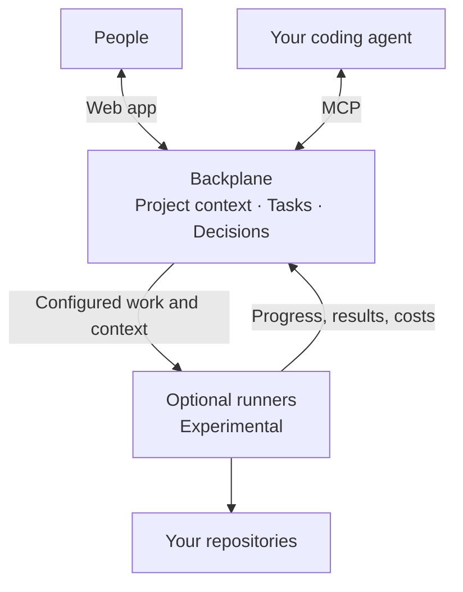

# Backplane

**Shared context for projects that outlive a coding session.**

Keep project knowledge, decisions, and work connected across your team and your
coding agents. Backplane brings project definitions, tasks, notes, and decisions
into one durable workspace, so people and agents can work from shared context
as a project grows.

[Get started](#self-hosting) · [Connect an agent](#connect-your-agent) ·
[Documentation](#documentation) ·
[Report an issue](https://github.com/Valaris-Studio/backplane/issues/new/choose)

> **Open Source Preview.** Self-host Backplane and bring your own coding agents.
> APIs and workflows may evolve as we incorporate feedback.
> **Runners are experimental.** See [Known limitations](#known-limitations)
> before planning a deployment.

## Three ways to use Backplane

| Organize your projects | Connect your agent | Run configured workflows |
|---|---|---|
| Keep tasks, project definitions, notes, and decisions together. Collaborate with your team in the app. | Give your coding agent access to shared project context and work through MCP. | Add optional runners to execute workflows you configure and report progress, results, and costs. |
| Useful on its own, without an agent. | Bring your own agent and credentials. No runner required. | Experimental. You choose roles, providers, budgets, and approval gates. |

## Why I'm building Backplane

When we founded [Valaris](https://valaris.studio), I kept coming back to two
questions: how do we keep a team aligned when everyone works with coding agents,
and how do we stay aware of our projects' context and progress?

Backplane started as our project management tool. It gradually became our shared
context manager: the place we use every day to organize work, preserve decisions,
and collaborate on our own projects and our customers' projects.

Coding agents are awesome. But over longer projects, their sessions can start to
look like Swiss cheese: useful work, with holes in the context between sessions,
people, and tools. Those gaps accumulate unless someone actively takes care of
them.

"Trust me bro" isn't enough for us. We want to understand what's planned, when
and how it should happen, and what happened before. And we want that information
to be easy to share with both people and agents.

Backplane gives us a durable place to keep that context and coordinate the work
around it. We built it for ourselves, and we're opening it up because we think
others might find it useful too.

**Sebastian, cofounder of Valaris**

## Your workflow belongs here

Backplane provides the tools; you define how your team works. Organize your
projects, establish your conventions, and configure workflows around your own
methodology. There is no single prescribed way to run a project.

That flexibility takes some setup. You'll make choices about how to structure
context and coordinate work. Backplane is built for people who want that control.

## How it fits together



Backplane supplies no intelligence: you bring your own agents. The platform owns
configuration, scheduling, prompts, and authorization; runners execute that
contract. Runners can work in separate Git branches and open pull requests, but
execute agent commands on their host. See
[Known security posture](SECURITY.md#known-security-posture).

The runner supports Claude Code and Codex CLI, with GitHub and Gitea for the
pull-request lifecycle. You can also use the platform through MCP from your own
agent without running a runner.

<details>
<summary>Inside the repository</summary>

| Component | What it is |
|---|---|
| `backend/` | FastAPI + SQLAlchemy API: workspaces, boards, cards, executions, the scheduler that decides which runner gets which card |
| `frontend/` | React + Vite web app: boards, pipeline builder, runner console, live observer |
| `mcp-server/` | MCP server exposing the platform tool catalog to AI agents: on PyPI as [`backplane-mcp`](https://pypi.org/project/backplane-mcp/) ([README](mcp-server/README.md)) |
| `runner/` | The autonomous runner (Go): polls for work, drives the coding agent, pushes branches, opens PRs |
| `docs/` | References and historical design documents; follow each document's status notice |
| `infra/`, `scripts/` | Provisioning and dev/smoke scripts |

</details>

## Self-hosting

The production stack is one compose file (Postgres, backend, frontend), with
local password login on by default and no cloud dependency:

```bash
git clone https://github.com/Valaris-Studio/backplane.git
cd backplane
cp .env.example .env
# in .env, fill in the two required secrets:
#   POSTGRES_PASSWORD: any strong value
#   OAUTH_STATE_SIGNING_KEY: generate with: openssl rand -hex 32
# browsing from another machine? also set BACKPLANE_URL=http://<host-ip>:8080
docker compose -f docker-compose.prod.yml up -d
```

Open **http://localhost:8080** or your `BACKPLANE_URL` (port override:
`BACKPLANE_HTTP_PORT`). A fresh instance shows a first-run screen to create
the admin account; after that it's the normal login page. Backend and frontend
build from source on the first `up` (no published images), and database
migrations run automatically on startup, no manual step.

The first `up -d` builds both images from source and then runs migrations, so
it can take a few minutes before anything answers. The frontend won't accept
traffic until the backend reports healthy, so you'll see nothing rather than a
half-broken page in the meantime. Watch progress with
`docker compose -f docker-compose.prod.yml logs -f backend`, and check
`docker compose -f docker-compose.prod.yml ps`; services show `(healthy)`
once ready. If backend instead cycles between `unhealthy` and `restarting`,
that's a migration or startup crash-loop; the backend logs above are where to
look.

Optional: seed the same demo workspace as dev; pass the email of the account
you created at first run so it gets owner access to the seeded workspace:

```bash
docker compose -f docker-compose.prod.yml exec -T backend python -m scripts.seed_demo --email you@example.com
```

Hardening an internet-facing deployment (TLS, proxies, OIDC) is covered in [`SECURITY.md`](SECURITY.md) and the in-app
documentation's *Securing a Self-Hosted Deployment* section.

## Connect your agent

Once your instance is running, connect an MCP-capable coding agent to read
project context and work with boards, cards, and notes.

1. Create a platform API key from your account menu under **API Keys**.
2. Follow the [MCP setup guide](mcp-server/README.md#configure) to configure
   `backplane-mcp` with your instance URL and API key in your client.
3. Start with the `default` toolset for everyday project work.

The MCP server is available on [PyPI](https://pypi.org/project/backplane-mcp/)
and runs through `uvx backplane-mcp`. The setup guide covers credentials,
client configuration, and protecting remote HTTP connections.

### Optional runners

Adding a runner is a separate step: you need a coding-agent CLI on PATH and
forge credentials. In the app, it's the **Launch runner wizard** at **Runner →
Runners → Create runner**, which walks Identity → Roles → Config → Launch and
ends with the command that starts the binary. The full write-up is in the in-app
documentation (**Documentation → Getting Started → Registering a Runner**), also
readable at `/documentation` without creating a workspace, and mirrored in
[`runner/README.md`](runner/README.md#quickstart). If `~/.claude.json` doesn't
exist yet, `touch ~/.claude.json` before your first `make dev-runner`;
otherwise Docker creates a root-owned directory at that path instead of
bind-mounting the file.

## Quickstart

This is the local development setup, with automatic authentication. For an
instance with password login, follow [Self-hosting](#self-hosting).

You need Docker + Compose, git, make, bash, and curl. The stack runs in
containers; native Python, Node, pnpm, and Go installs are only needed for
[development outside Docker](CONTRIBUTING.md#dev-setup). `lsof` improves the
health helpers' port checks when available.

`make dev` runs in the foreground and keeps streaming logs, so the optional
seed goes in a second terminal.

```bash
# Terminal A
git clone https://github.com/Valaris-Studio/backplane.git
cd backplane
cp .env.example .env      # defaults work for local dev as-is
make dev                  # Postgres :5433 + backend :8000 + frontend :5173
```

Wait for `Application startup complete` from the backend and `VITE ready` from
the frontend. The backend runs its migrations on startup, so first boot takes
a little longer.

```bash
# Terminal B (optional)
make seed-demo            # a sample workspace + populated board
```

Open **http://localhost:5173**. In dev mode you are authenticated automatically
as `dev@valaris.dev`, with no signup flow.

**Stopping and restarting**

`Ctrl+C` in Terminal A stops the stack; your database survives in a Docker
volume, so `make dev` picks up where you left off. To throw everything away,
run `make clean`. It runs `docker compose down -v` and also removes local
`node_modules` and build output. **That deletes your database.**

`make seed-demo` gives you something to click through instead of an empty
screen. It is safe to re-run, and it refuses to add demo data to an instance
that already holds real work (pass `FORCE=1` to override).

Not sure if the stack actually came up cleanly? `make doctor` prints a
one-shot health readout: container health, listening ports, endpoint probes,
and migration head. It is the quick answer to "is my stack actually up?"

API docs (Swagger UI): **http://localhost:8000/api/docs**

For native development and test commands, see
[Contributing](CONTRIBUTING.md#dev-setup). Use `make runner-test` for runner
checks; bare Go tests inside this repository can modify the live worktree.

`make quickstart-gate` verifies the development Quickstart in a temporary copy
with disposable containers, volumes, and randomized ports. It needs Docker and
can run while `make dev` is up.

## Documentation

The full documentation ships **inside the app**, covering
core concepts, configuration of every pipeline field, operations, architecture,
and an honest "rough edges" section. Open `/documentation` on your instance:
[self-hosted](http://localhost:8080/documentation) or
[local development](http://localhost:5173/documentation).

Reference material also lives in-repo:

| Doc | What's in it |
|---|---|
| [`docs/platform-source-of-truth.md`](docs/platform-source-of-truth.md) | Historical architecture reference; current behavior is documented in-app |
| [`docs/pipeline-config-reference.md`](docs/pipeline-config-reference.md) | Historical pipeline design reference; use in-app documentation for current fields |
| [`docs/events.md`](docs/events.md) | Event taxonomy |
| [`docs/git-credentials.md`](docs/git-credentials.md) | Connecting a workspace's own forge account: per-provider tokens, scopes, troubleshooting |
| [`runner/docs/providers.md`](runner/docs/providers.md) | Coding-agent and forge providers |
| [`docs/api/openapi.json`](docs/api/openapi.json) | Exported REST API schema: browse it via [`docs/api/index.html`](docs/api/index.html) |
| [`CONTRIBUTING.md`](CONTRIBUTING.md) | Contribution policy, dev setup, architecture rules, TDD workflow |

Any running instance serves the same API contract live: Swagger UI at `/api/docs`
in dev, and the machine-readable schema at `/api/openapi.json`. Regenerate the
checked-in copy with `python scripts/export-openapi.py` (backend venv active).

## Known limitations

Being upfront, because these decide whether Backplane fits you today:

- **Authentication is young.** Local email + password login works out of the box
  (on by default): a fresh instance opens with a first-run admin setup screen,
  failed logins are throttled per IP and lock the account after 5 straight
  misses, and workspace admins manage accounts. No identity provider or
  fronting proxy is required. Generic OIDC (Keycloak, Authentik, Google, Entra,
  Okta), Google Cloud IAP, and an explicit trusted-proxy mode also work, and
  production refuses to start with no verifier at all. But the whole surface
  has far less mileage than the rest of the platform. Treat a first deployment
  as something to verify, not assume. SAML, SCIM, enforced MFA and email-based
  password reset are not implemented; password recovery is a workspace admin
  setting a temporary password.
- **Object storage** defaults to local disk; the alternative path is Google Cloud
  Storage. No S3 driver yet.
- **The backend and frontend ship as source, not images.** Self-hosting builds
  them locally via docker compose. The client artifacts *are* released: the
  runner as a multi-arch image (`ghcr.io/valaris-studio/backplane-runner`) and
  as standalone binaries with checksums
  ([darwin/linux/windows × arm64/amd64](https://storage.googleapis.com/backplane-artifacts/runner/v0.8.4/SHA256SUMS)),
  and the MCP server via `uvx backplane-mcp`.
- **GitLab PAT connections are supported** for repository credentials and the
  backend merge-queue plumbing. The runner forge driver for GitLab does not yet
  open, review, or merge merge requests; those lifecycle operations currently
  support GitHub and Gitea.

## Telemetry

**Telemetry is off by default.** The telemetry endpoint also ships empty.
Sending a ping requires both `BACKPLANE_TELEMETRY_ENABLED=true` and an explicit
`BACKPLANE_TELEMETRY_ENDPOINT`.

The optional ping contains five fields: a one-way hashed instance identifier,
the Backplane version, the Python version, and user and workspace counts.
It includes no names, emails, workspace slugs, card content, repository URLs,
or prompts. See the [payload implementation](backend/app/services/telemetry.py).

## Contributing

**Backplane is maintained solely by the Valaris team and is not accepting outside
code contributions yet.** Pull requests from outside the team will be closed
unreviewed. We have no contributor agreement in place and would rather say so
before you spend the time than after.

**Issues are open and wanted**: bug reports, feature requests, and questions all
help. Security reports go privately via [`SECURITY.md`](SECURITY.md), never a
public issue. The licenses permit forks. Fork freely.

We expect to open up to contributions once the architecture settles;
[`CONTRIBUTING.md`](CONTRIBUTING.md) carries the current policy alongside the dev
loop, the layering rules (Router → Service → Repository → Model), and the
test-first expectation.

## License

Per-component, mapped in **[`LICENSES.md`](LICENSES.md)**:

- Platform core (`backend/`, `frontend/`, `mcp-server/`): **AGPL-3.0-or-later**
- The runner (`runner/`): **MIT**
- API / OpenAPI / MCP tool schemas: **Apache-2.0**

Third-party dependencies, including one documented non-OSI exception (GSAP), are
covered in [`THIRD_PARTY_LICENSES.md`](THIRD_PARTY_LICENSES.md).

## Naming

The platform is **Backplane**. The `valaris` MCP namespace and `VALARIS_*`
environment variables are stable technical identifiers and are intentionally not
renamed; changing them would break every existing agent configuration. Full
policy: [`docs/branding.md`](docs/branding.md).
