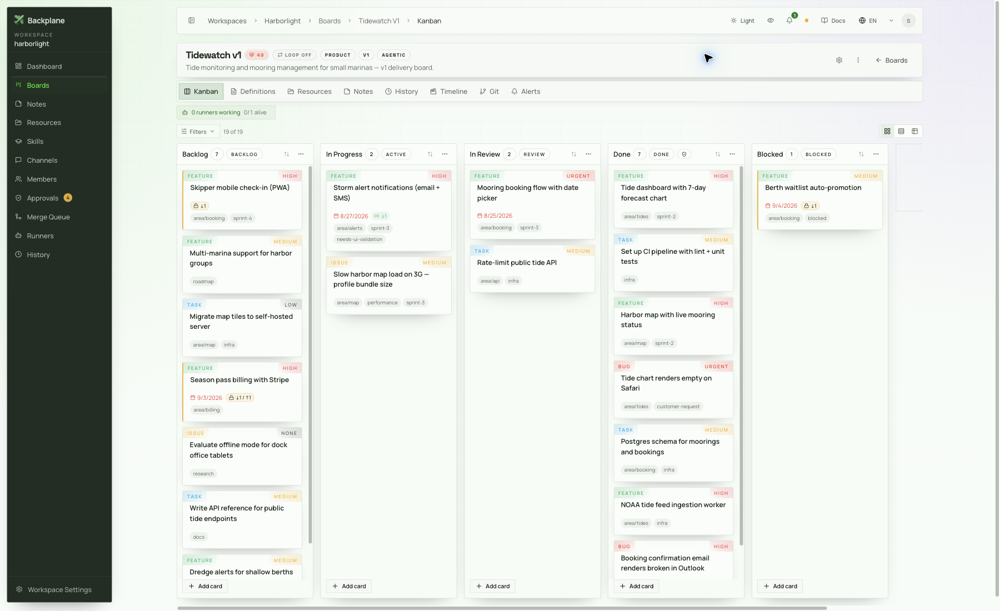
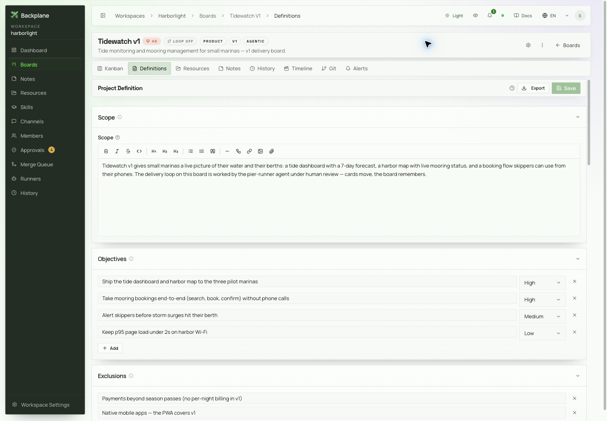
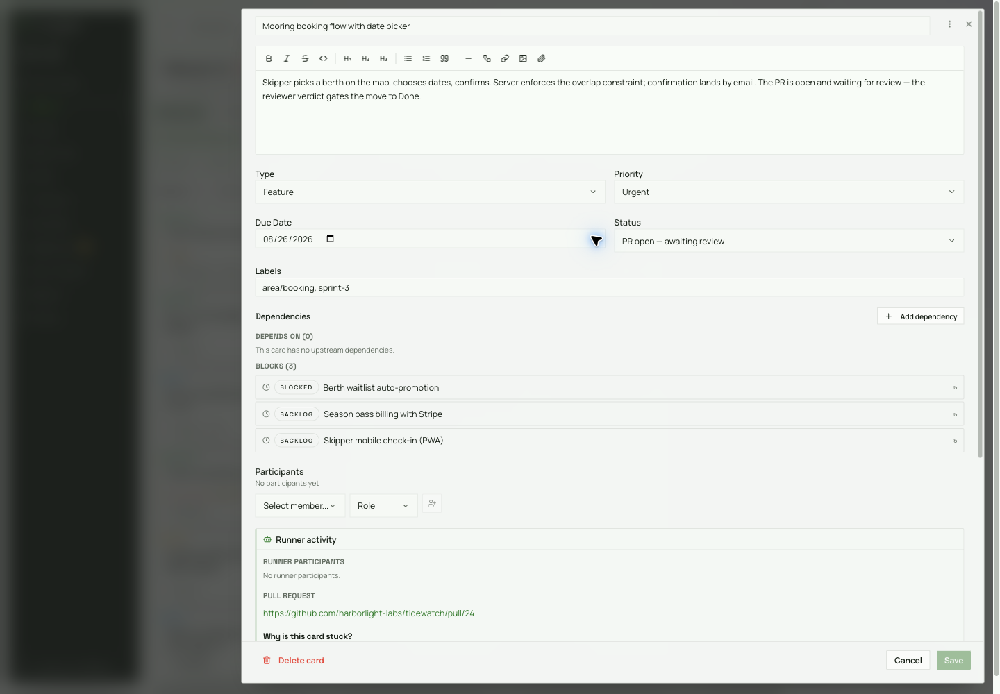
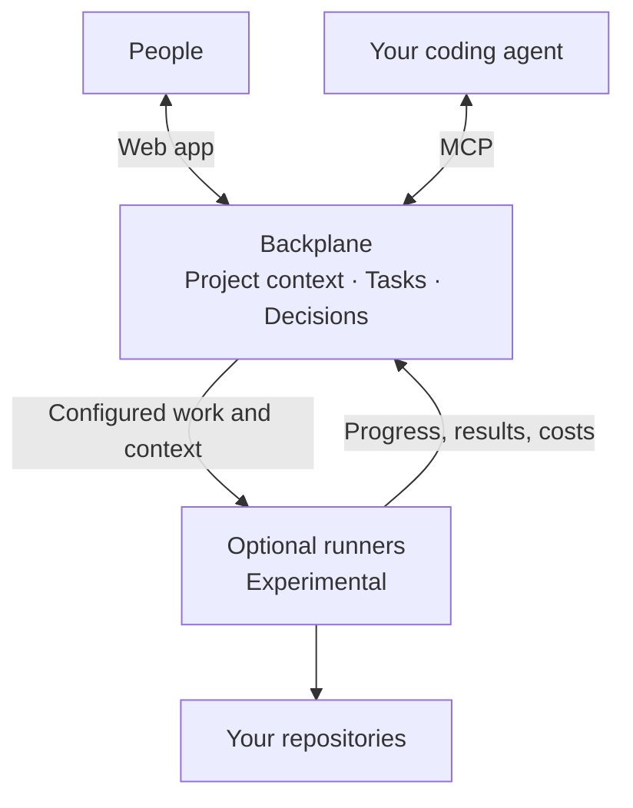

<p align="center">
  
</p>

<h1 align="center">Backplane</h1>

<p align="center"><strong>Shared context for projects that outlive a coding session.</strong></p>
<p align="center">🏠 Self-hosted &nbsp; · &nbsp; 🔌 Bring your own agents &nbsp; · &nbsp; 🧭 Your methodology</p>

**Start every new coding session with an organized, coherent and updated context**

Backplane is a **shared workspace for your team and coding agents**. Keep tasks,
project definitions, notes, and decisions together, so the next person or agent
can pick up the work with the context behind it.

[🏠 Self-host Backplane](#self-hosting) · [🔌 Connect your agent](#connect-your-agent) ·
[🌐 Website, Cloud & support](https://getbackplane.ai)

[Screenshots](#a-closer-look) · [Documentation](#documentation) ·
[Report an issue](https://github.com/Valaris-Studio/backplane/issues/new/choose)

> [!NOTE]
> **Open Source Preview.** Start with [Self-hosting](#self-hosting) for an instance
> with password login. Bring your own agents whenever you're ready.
>
> APIs and workflows may evolve. **Runners are experimental**; review the
> [known limitations](#known-limitations) before planning a deployment.

<picture>
  <source media="(prefers-color-scheme: dark)" srcset=".github/assets/readme/board-dark.png">
  
</picture>

<p align="center"><strong>See the project at a glance. Keep the details within reach.</strong><br>
<sub>Tidewatch demo project · Open full size: <a href=".github/assets/readme/board-light.png">Light</a> / <a href=".github/assets/readme/board-dark.png">Dark</a></sub></p>

## Three ways to use Backplane

<table>
  <tr>
    <td width="64" align="center"></td>
    <td>
      <strong>Organize the work, keep the context</strong><br>
      Tasks, definitions, notes, and decisions give you and your team a shared place to plan, track progress, and preserve why a decision was made.<br>
      <em>Start here. Useful on its own, without an agent.</em>
    </td>
  </tr>
  <tr>
    <td width="64" align="center"></td>
    <td>
      <strong>Let your agent join the project</strong><br>
      Connect through MCP to read and update boards, cards, and notes from the coding tools you already use.<br>
      <em>Your agent, your credentials. No runner required.</em>
    </td>
  </tr>
  <tr>
    <td width="64" align="center"></td>
    <td>
      <strong>Make delegated work observable</strong><br>
      Add optional runners for configured workflows. Choose roles, providers, budgets, and approval gates, then follow progress, results, and costs.<br>
      <em>Experimental. Configure the process around your team.</em>
    </td>
  </tr>
</table>

## Bring the agent you already use

**Your tools can change. Your project context can stay together.**

Backplane exposes its boards, cards, notes, and project context through **MCP**.
Choose a terminal, editor, or desktop assistant. Familiar clients with **local MCP
server support** include:

| Where you work | MCP clients |
|---|---|
| **⌨️ Terminal** | [Claude Code](https://code.claude.com/docs/en/mcp) · [Codex](https://developers.openai.com/codex/mcp/) · [Gemini CLI](https://geminicli.com/docs/tools/mcp-server/) · [GitHub Copilot CLI](https://docs.github.com/en/copilot/how-tos/copilot-cli/customize-copilot/add-mcp-servers) · [OpenCode](https://opencode.ai/docs/mcp-servers/) |
| **🧑‍💻 Editor** | [Cursor](https://cursor.com/docs/mcp) · [GitHub Copilot in VS Code](https://code.visualstudio.com/docs/agent-customization/mcp-servers) · [Cline](https://docs.cline.bot/mcp/mcp-overview) · [Roo Code](https://docs.roocode.com/features/mcp/using-mcp-in-roo) |
| **💬 Desktop** | [Claude Desktop](https://modelcontextprotocol.io/docs/develop/connect-local-servers) |

Use **`backplane-mcp` over stdio** to connect a compatible MCP client,
including **your own agent**, to your instance.
**Streamable HTTP** is also available where the client supports it. Follow the
linked client documentation and our [MCP setup guide](mcp-server/README.md#configure);
configuration and available MCP features vary by client.

**[Connect your agent →](#connect-your-agent)**

> **⚙️ Want Backplane to run the work?** The optional runner currently executes
> **Claude Code and Codex CLI**. [Runners are experimental](#optional-runners)
> and are a separate setup from connecting an MCP client.

## A closer look

<table>
  <tr>
    <td width="50%" valign="top">
      <strong>📍 Give everyone the same starting point</strong><br><br>
      <picture>
        <source media="(prefers-color-scheme: dark)" srcset=".github/assets/readme/definition-dark.png">
        
      </picture><br>
      <strong>Scope, objectives, and boundaries</strong> stay alongside the work they guide.<br>
      <a href=".github/assets/readme/definition-light.png">Full size: light</a> · <a href=".github/assets/readme/definition-dark.png">dark</a>
    </td>
    <td width="50%" valign="top">
      <strong>🔎 Follow the work beyond its status</strong><br><br>
      <picture>
        <source media="(prefers-color-scheme: dark)" srcset=".github/assets/readme/card-dark.png">
        
      </picture><br>
      Keep the <strong>description, dependencies, participants, and linked pull request</strong> together.<br>
      <a href=".github/assets/readme/card-light.png">Full size: light</a> · <a href=".github/assets/readme/card-dark.png">dark</a>
    </td>
  </tr>
</table>

<sub>Original captures of fictional demo projects, September 2026. Screenshots follow your light or dark theme.</sub>

**Want the full tour?** [Explore more product screens](https://getbackplane.ai/en/screens),
including notes, resources, approvals, skills, and activity views.

## Why I'm building Backplane

> When we founded [Valaris](https://valaris.studio), I kept coming back to two questions:
>
> - **How do we keep a team aligned** when everyone works with coding agents?
> - **How do we stay aware** of our projects' context and progress?
>
> Backplane started as our project management tool. It gradually became our shared
> context manager: the place we use every day to organize work, preserve decisions,
> and collaborate on our own projects and our customers' projects.
>
> Coding agents are awesome. But over longer projects, their sessions can start to
> look like **Swiss cheese**: useful work, with holes in the context between sessions,
> people, and tools. Those gaps accumulate unless someone actively takes care of them.
>
> **"Trust me bro" isn't enough for us.** We want to understand what's planned,
> when and how it should happen, and what happened before.
>
> And we want that information to be easy to share with both people and agents.
>
> Backplane gives us a durable place to keep that context and coordinate the work
> around it. We built it for ourselves, and we're opening it up because we think
> others might find it useful too.
>
> **[Sebastian](https://www.linkedin.com/in/sebastian-breit-foncillas-a79723124/), cofounder of [Valaris](https://valaris.studio)**

## Your workflow belongs here

**Backplane provides the tools. You define how your team works.**

Organize your projects, establish your conventions, and configure workflows around
**your own methodology**. There is no single prescribed way to run a project.

That flexibility takes some setup. You'll make choices about how to structure
context and coordinate work. Backplane is built for people who want that control.

**Different sessions. One place to pick up the thread.**

```text
 session 01   session 02   session 03
      \           |           /
       +----------+----------+
                  |
            [ Backplane ]
          context that stays
```

## How it fits together



**🧩 Bring the intelligence. Backplane keeps the work connected.**

- **People and agents share the same project record**, through the web app and MCP.
- **The platform owns the configuration**, scheduling, prompts, and authorization.
- **Optional runners execute that contract** and report progress, results, and costs.

Runners can work in **separate Git branches** and open pull requests. They execute
agent commands on their host; see [Known security posture](SECURITY.md#known-security-posture).

The runner currently supports **Claude Code and Codex CLI**, with **GitHub and Gitea**
for the pull-request lifecycle. Connecting through MCP **does not require a runner**.

<details>
<summary>Inside the repository</summary>

| Component | What it is |
|---|---|
| `backend/` | FastAPI + SQLAlchemy API: workspaces, boards, cards, executions, the scheduler that decides which runner gets which card |
| `frontend/` | React + Vite web app: boards, pipeline builder, runner console, live observer |
| `mcp-server/` | MCP server exposing the platform tool catalog to AI agents: on PyPI as [`backplane-mcp`](https://pypi.org/project/backplane-mcp/) ([README](mcp-server/README.md)) |
| `runner/` | The autonomous runner (Go): polls for work, drives the coding agent, pushes branches, opens PRs |
| `docs/` | References and historical design documents; follow each document's status notice |
| `infra/`, `scripts/` | Provisioning and dev/smoke scripts |

</details>

## Self-hosting

🏠 **Your infrastructure. Your project context.**

Run Backplane with **one Compose file**: Postgres, backend, and frontend.
**Local password login is enabled by default**, with no cloud dependency.

> **☁️ Cloud & support:** Visit [getbackplane.ai](https://getbackplane.ai) for
> product information and the planned **Backplane Cloud** offering, including
> managed hosting, support, and guided onboarding. **Cloud is not yet available.**

**1. Configure and start**

```bash
git clone https://github.com/Valaris-Studio/backplane.git
cd backplane
cp .env.example .env
# in .env, fill in the two required secrets:
#   POSTGRES_PASSWORD: any strong value
#   OAUTH_STATE_SIGNING_KEY: generate with: openssl rand -hex 32
# browsing from another machine? also set BACKPLANE_URL=http://<host-ip>:8080
docker compose -f docker-compose.prod.yml up -d
```

**2. Create your admin account**

Open **http://localhost:8080** or your `BACKPLANE_URL`.
The first-run screen creates your admin account; later visits use the normal login page.
Use `BACKPLANE_HTTP_PORT` to override the port.

**The first start builds backend and frontend from source**, then runs database
migrations automatically. There are no published images for these two services
and no manual migration step. Allow a few minutes for the first build and startup.

<details>
<summary>🔎 Watch startup progress or troubleshoot a slow first boot</summary>

The frontend accepts traffic only after the backend reports healthy. Until then,
the page is unavailable while the stack finishes starting.

Follow the backend logs:

```bash
docker compose -f docker-compose.prod.yml logs -f backend
```

Check service status:

```bash
docker compose -f docker-compose.prod.yml ps
```

Services show **`(healthy)`** once ready. If the backend cycles between
`unhealthy` and `restarting`, inspect its logs for a migration or startup crash.

</details>

**3. Explore a populated workspace (optional)**

Seed the same demo workspace used in development. Pass the email of your
first-run account to give it **owner access** to the seeded workspace:

```bash
docker compose -f docker-compose.prod.yml exec -T backend python -m scripts.seed_demo --email you@example.com
```

> [!IMPORTANT]
> **Putting Backplane on the internet?** Follow [`SECURITY.md`](SECURITY.md) and
> **Securing a Self-Hosted Deployment** in the in-app documentation for TLS,
> proxies, and OIDC.

## Connect your agent

🔌 **Bring your agent into the same project context.**

Once your instance is running, connect an MCP-capable coding agent to read
context and work with **boards, cards, and notes**.

1. **Create an API key** from your account menu under **API Keys**.
2. **Connect your client** using the [MCP setup guide](mcp-server/README.md#configure).
   Configure `backplane-mcp` with your instance URL and API key.
3. **Start with the `default` toolset** for everyday project work.

The MCP server is available on [PyPI](https://pypi.org/project/backplane-mcp/)
and runs through **`uvx backplane-mcp`**. The setup guide covers credentials,
client configuration, and protecting remote HTTP connections.

**💡 Give your agent somewhere to start.** Once connected, try:

> Read this project's definition and summarize its goals and constraints.

> Show me the blocked cards and their dependencies.

> Record our decision in a project note so the next session can find it.

Use your own prompts and conventions. **The shared context stays in Backplane**
when you switch sessions or tools.

### Optional runners

⚙️ **Ready to let agents pick up work?** Add a runner as a separate step.
**Runners are experimental.** You need a **coding-agent CLI on PATH** and
**forge credentials**.

Open **Runner → Runners → Create runner** to use the **Launch runner wizard**:

```text
Identity → Roles → Config → Launch
```

The wizard ends with the command that starts the binary. For the full guide, see
**Documentation → Getting Started → Registering a Runner** in the app, or
[`runner/README.md`](runner/README.md#quickstart).
The in-app guide is also available at `/documentation` without creating a workspace.

> [!NOTE]
> **Before your first `make dev-runner`:** if `~/.claude.json` does not exist,
> run `touch ~/.claude.json`. Otherwise Docker creates a root-owned directory
> at that path instead of bind-mounting the file.

## Quickstart

🛠️ **Working on Backplane itself? Start here.**

This is the **local development setup**, with automatic authentication.
For an instance with password login, follow [Self-hosting](#self-hosting).

**You need:** Docker + Compose, git, make, bash, and curl.
The stack runs in containers. Native Python, Node, pnpm, and Go installs are only
needed for [development outside Docker](CONTRIBUTING.md#dev-setup).
Optional `lsof` improves the health helpers' port checks.

**1. Start the stack in Terminal A**

```bash
# Terminal A
git clone https://github.com/Valaris-Studio/backplane.git
cd backplane
cp .env.example .env      # defaults work for local dev as-is
make dev                  # Postgres :5433 + backend :8000 + frontend :5173
```

`make dev` stays in the foreground and streams logs.
Wait for **`Application startup complete`** from the backend and **`VITE ready`**
from the frontend. Migrations run automatically, so first boot takes a little longer.

**2. Add sample work in Terminal B (optional)**

```bash
# Terminal B (optional)
make seed-demo            # a sample workspace + populated board
```

The demo gives you a **populated board to explore**. It is safe to re-run and
refuses to add demo data to an instance that already holds real work.
Use `FORCE=1` only if you intend to override that protection.

**3. Open the app**

- **App:** http://localhost:5173. You are automatically authenticated as
  `dev@valaris.dev`, with no signup flow.
- **Interactive API docs:** http://localhost:8000/api/docs (Swagger UI).

**Stop and resume:** `Ctrl+C` in Terminal A stops the stack. Your database stays
in a Docker volume, so `make dev` picks up where you left off.

> [!WARNING]
> **`make clean` deletes your database.** It runs `docker compose down -v` and
> also removes local `node_modules` and build output. Use it only when you want
> to throw everything away.

<details>
<summary>🧪 Check stack health and the development setup</summary>

- **`make doctor`** gives a one-shot health readout: container health, listening
  ports, endpoint probes, and migration head.
- **`make quickstart-gate`** verifies this Quickstart in a temporary copy, using
  disposable containers, volumes, and randomized ports. It needs Docker and
  can run while `make dev` is up.
- **[Native development and test commands](CONTRIBUTING.md#dev-setup)** cover
  working on individual components outside Docker.

**Use `make runner-test` for runner checks.** Bare Go tests inside this repository
can modify the live worktree.

</details>

## Documentation

📚 **The full guide ships with the app.**

Open **`/documentation`** on your instance:
[self-hosted](http://localhost:8080/documentation) ·
[local development](http://localhost:5173/documentation).

It covers **core concepts, every pipeline field, operations, and architecture**,
plus a candid guide to current rough edges.

**Find the reference you need:**

| Looking for | Read |
|---|---|
| **Events** | [Event taxonomy](docs/events.md) |
| **Forge credentials** | [Accounts, tokens, scopes, and troubleshooting](docs/git-credentials.md) |
| **Agent and forge providers** | [Provider guide](runner/docs/providers.md) |
| **REST API** | [Schema](docs/api/openapi.json) · [API browser](docs/api/index.html) |
| **Development** | [Contribution policy, setup, architecture, and tests](CONTRIBUTING.md) |
| **Architecture history** | [Historical reference](docs/platform-source-of-truth.md); use in-app docs for current behavior |
| **Pipeline history** | [Historical design](docs/pipeline-config-reference.md); use in-app docs for current fields |

**Need the live API contract?** A running instance serves Swagger UI at
`/api/docs` in development and the machine-readable schema at `/api/openapi.json`.
The checked-in export may lag the live schema. Regenerate it with
`python scripts/export-openapi.py` while the backend venv is active.

## Known limitations

🚧 **Know what fits today and what still needs care.**

**Authentication works out of the box, but is still young.** It has less mileage
than the rest of the platform. Verify your first deployment carefully.

| Authentication today | Details |
|---|---|
| **Local login** | Email + password is on by default, with a first-run admin setup screen. No identity provider or fronting proxy is required. |
| **Login protection** | Failed logins are throttled per IP. Accounts lock after 5 consecutive failed attempts. |
| **Account management** | Workspace admins manage accounts. Password recovery requires an admin to set a temporary password. |
| **External authentication** | Generic OIDC (Keycloak, Authentik, Google, Entra, Okta), Google Cloud IAP, and explicit trusted-proxy mode are supported. Production refuses to start with no verifier. |
| **Not implemented** | SAML, SCIM, enforced MFA, and email-based password reset. |

**Other boundaries to consider:**

- **Storage:** local disk by default, with Google Cloud Storage as an alternative.
  There is **no S3 driver** yet.
- **Distribution:** backend and frontend ship as **source, not images**;
  Docker Compose builds them locally. Client artifacts are released separately:
  the runner as a multi-arch image (`ghcr.io/valaris-studio/backplane-runner`)
  and standalone binaries with checksums
  ([darwin/linux/windows × arm64/amd64](https://storage.googleapis.com/backplane-artifacts/runner/v0.8.4/SHA256SUMS)),
  and the MCP server through `uvx backplane-mcp`.
- **GitLab PAT connections are supported** for repository credentials and backend
  merge-queue plumbing. The runner forge driver for GitLab does not yet open,
  review, or merge merge requests. Those lifecycle operations currently support
  **GitHub and Gitea**.

## Telemetry

🔒 **Telemetry is off by default. The endpoint ships empty.**

Sending a ping requires **both** settings:

```text
BACKPLANE_TELEMETRY_ENABLED=true
BACKPLANE_TELEMETRY_ENDPOINT=<your-explicit-endpoint>
```

- **Five fields only:** a one-way hashed instance identifier, Backplane version,
  Python version, user count, and workspace count.
- **No project content:** no names, emails, workspace slugs, card content,
  repository URLs, or prompts.

Inspect the [payload implementation](backend/app/services/telemetry.py).

## Contributing

💬 **Your feedback helps shape Backplane.**

| You can help with | Where to go |
|---|---|
| **Bug reports, feature requests, and questions** | [Open an issue](https://github.com/Valaris-Studio/backplane/issues/new/choose) |
| **Security reports** | Follow [`SECURITY.md`](SECURITY.md) privately. Never open a public issue. |
| **Your own adaptations** | Fork freely under the applicable [component licenses](LICENSES.md). |

**Backplane is maintained solely by the Valaris team and is not accepting outside
code contributions yet.** External pull requests will be closed unreviewed.
We have no contributor agreement in place and want you to know before investing
time in a patch.

We expect to open contributions once the architecture settles.
[`CONTRIBUTING.md`](CONTRIBUTING.md) carries the current policy, development loop,
**Router → Service → Repository → Model** layering rules, and test-first expectation.

## License

⚖️ **Licensing follows the component.** See the full map in
**[`LICENSES.md`](LICENSES.md)**.

| Component | License |
|---|---|
| **Platform core:** `backend/`, `frontend/`, `mcp-server/` | AGPL-3.0-or-later |
| **Runner:** `runner/` | MIT |
| **API / OpenAPI / MCP tool schemas** | Apache-2.0 |

Third-party dependencies, including the documented **non-OSI exception (GSAP)**,
are covered in [`THIRD_PARTY_LICENSES.md`](THIRD_PARTY_LICENSES.md).

## Naming

🏷️ **The product is Backplane.** The `valaris` MCP namespace and `VALARIS_*`
environment variables remain **stable technical identifiers** so existing agent
configurations keep working.

See the [full naming policy](docs/branding.md).

<p align="center"><strong>Keep the next session connected to the work you have already done.</strong><br>
<a href="#self-hosting">Self-host Backplane</a> · <a href="#connect-your-agent">Connect your agent</a> · <a href="https://getbackplane.ai">Explore Backplane, Cloud & support</a></p>
